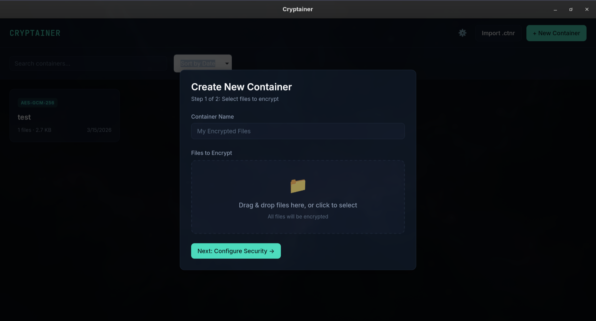

# Cryptainer - V2 coming soon

> **Offline Encrypted Container Manager** - Securely store and manage your files with military-grade encryption

[](https://www.rust-lang.org/)
[](https://reactjs.org/)
[](https://www.typescriptlang.org/)
[](https://tauri.app/)

<p align="center">
  
</p>

## Features

### Core Functionality
- **🔐 Military-Grade Encryption**: AES-256-GCM authenticated encryption with Argon2id key derivation
- **📦 Encrypted Containers**: Store multiple files in a single encrypted container
- **🔓 Password Protection**: Unlock containers with your password - no keys stored anywhere
- **✏️ Edit Mode**: Add or remove files from existing containers with automatic re-encryption
- **💾 Portable Format**: Export/import containers using the `.ctnr` file format
- **🗄️ Local Storage**: All data stored locally - no cloud, no servers, 100% offline

### Security Features
- **Memory-Safe Key Handling**: Keys are wiped from memory immediately after use (Zeroize)
- **Session Management**: Unlocked containers held in memory only, cleared on lock/app close
- **Integrity Protection**: SHA-256 checksums detect tampering or corruption
- **Configurable Security Levels**: Choose from Fast, Standard, High, or Paranoid Argon2id settings
- **Auto-Lock**: Automatically lock containers after period of inactivity

### File Support
- **Images**: PNG, JPG, GIF, WebP (with preview)
- **Videos**: MP4, WebM (with playback)
- **Audio**: MP3, WAV, OGG (with playback)
- **Documents**: PDF (with viewer)
- **Code Files**: 20+ languages with syntax highlighting (Rust, TypeScript, Python, etc.)
- **Text Files**: UTF-8 text with line numbers
- **Binary Files**: Hex dump view with offset/hex/ASCII display

### User Experience
- **🔍 Search & Filter**: Search containers by name or tags
- **🏷️ Tag System**: Organize containers with custom tags
- **📊 Sort Options**: Sort by name, date, size, or file count
- **⚙️ Settings**: Configure default security, auto-lock timeout, and theme
- **🔑 Password Hints**: Optional hints to help remember passwords
- **💪 Password Strength**: Visual indicator for password strength
- **🎨 Dark Theme**: Beautiful dark UI with accent colors

## Tech Stack

### Backend
- **Rust** - Systems programming with memory safety
- **Tauri v2** - Secure desktop/mobile app framework
- **AES-256-GCM** - Authenticated encryption
- **Argon2id** - Memory-hard password hashing
- **SQLite** - Local metadata storage
- **sqlx** - Type-safe SQL queries

### Frontend
- **React 18** - UI framework
- **TypeScript** - Type-safe JavaScript
- **Vite** - Fast build tooling
- **Zustand** - State management
- **Prism.js** - Syntax highlighting

## Installation

### Prerequisites
- [Node.js](https://nodejs.org/) (v18+)
- [Rust](https://www.rust-lang.org/tools/install)
- [Tauri CLI](https://tauri.app/v1/guides/getting-started/prerequisites)

### Desktop (Linux/macOS/Windows)

```bash
# Clone the repository
git clone https://github.com/yourusername/cryptainer.git
cd cryptainer

# Install dependencies
npm install

# Run in development mode
npm run tauri dev

# Build for production
npm run tauri build
```

### Linux Dependencies
```bash
# Arch Linux / Omarchy
sudo pacman -S --needed base-devel curl wget file openssl gtk3 libayatana-appindicator librsvg webkit2gtk-4.1

# Ubuntu/Debian
sudo apt-get install -y libwebkit2gtk-4.1-dev libjavascriptcoregtk-4.1-dev build-essential libssl-dev libgtk-3-dev libayatana-appindicator3-dev librsvg2-dev
```

## Usage

### Creating a Container
1. Click "+ New Container"
2. Select files to encrypt
3. Choose security level (Standard recommended)
4. Set a strong password
5. Optional: Add password hint and tags
6. Click "Create & Encrypt"

### Opening a Container
1. Click on a container card
2. Enter your password
3. View files in the container
4. Click any file to preview

### Editing a Container
1. Open an unlocked container
2. Click "Edit" button
3. Remove files or add new ones
4. Enter password to save changes
5. Container is automatically re-encrypted

### Export/Import
- **Export**: Hover over container → click download icon → save `.ctnr` file
- **Import**: Click "Import .ctnr" → select file(s) → imported containers appear in vault

## Security Model

### What IS Protected
- ✅ File contents (encrypted with AES-256-GCM)
- ✅ File names and metadata (inside encrypted payload)
- ✅ Container structure and organization

### What is NOT Protected (Visible in Plaintext)
- Container name (shown in UI for identification)
- Creation/modification dates
- File count and total size
- Password hint (intentionally visible)
- Algorithm and KDF parameters

### Threat Model
- **Protects against**: Unauthorized access, offline attacks, database theft
- **Does NOT protect against**: Compelled disclosure (password required), memory attacks (keys in RAM when unlocked)

## Architecture

```
┌─────────────────┐     ┌──────────────────┐
│   React App     │────▶│   Tauri Bridge   │
│   (Frontend)    │◀────│   (IPC Commands) │
└─────────────────┘     └──────────────────┘
                               │
                               ▼
                        ┌──────────────────┐
                        │   Rust Backend   │
                        │                  │
                        │  ┌────────────┐  │
                        │  │   Crypto   │  │
                        │  │  (Encrypt) │  │
                        │  └────────────┘  │
                        │  ┌────────────┐  │
                        │  │   Vault    │  │
                        │  │  (Structs) │  │
                        │  └────────────┘  │
                        │  ┌────────────┐  │
                        │  │  Storage   │  │
                        │  │  (SQLite)  │  │
                        │  └────────────┘  │
                        │  ┌────────────┐  │
                        │  │  Session   │  │
                        │  │  (Memory)  │  │
                        │  └────────────┘  │
                        └──────────────────┘
                               │
                               ▼
                        ┌──────────────────┐
                        │   File System    │
                        │  (.ctnr / .enc)  │
                        └──────────────────┘
```

## Development

### Project Structure
```
cryptainer/
├── docs/                      # Documentation
│   ├── PROGRESS.md           # Build progress log
│   ├── ARCHITECTURE.md       # System design
│   ├── CRYPTO.md             # Cryptographic specs
│   ├── API.md                # IPC command docs
│   └── kimi-docs/            # Backup copies
├── src/                       # React frontend
│   ├── components/
│   │   ├── Container/        # Container UI components
│   │   ├── Preview/          # File preview components
│   │   ├── Settings/         # Settings UI
│   │   └── UI/               # Shared UI components
│   ├── hooks/                # Custom React hooks
│   ├── store/                # Zustand state management
│   ├── types/                # TypeScript types
│   └── styles/               # Global CSS
├── src-tauri/                 # Rust backend
│   ├── src/
│   │   ├── main.rs           # Entry point
│   │   ├── lib.rs            # Library setup
│   │   ├── error.rs          # Error types
│   │   ├── crypto.rs         # Encryption/decryption
│   │   ├── vault.rs          # Data structures
│   │   ├── storage.rs        # SQLite operations
│   │   ├── session.rs        # In-memory sessions
│   │   ├── export.rs         # .ctnr format
│   │   └── commands.rs       # Tauri IPC handlers
│   ├── migrations/           # Database migrations
│   └── Cargo.toml            # Rust dependencies
├── tests/                     # Integration tests
├── package.json              # Node.js dependencies
├── tsconfig.json             # TypeScript config
└── vite.config.ts            # Vite configuration
```

### Running Tests

```bash
# Rust unit tests
cargo test

# TypeScript type checking
npx tsc --noEmit

# Run linter (if configured)
cargo clippy -- -D warnings
```

### Adding a New Feature

1. **Backend (Rust)**:
   - Add command to `src-tauri/src/commands.rs`
   - Register in `src-tauri/src/lib.rs`
   - Add tests if applicable

2. **Frontend (React)**:
   - Add IPC call to `src/store/vaultStore.ts`
   - Create/update components in `src/components/`
   - Update types in `src/types/vault.ts` if needed

3. **Documentation**:
   - Update `docs/PROGRESS.md`
   - Update `docs/ARCHITECTURE.md` if architecture changes
   - Update `docs/API.md` if new commands added

## Cryptographic Details

### Encryption
- **Algorithm**: AES-256-GCM (authenticated encryption)
- **Key Size**: 256 bits
- **Nonce**: 96 bits (random per encryption)
- **Tag**: 128 bits GCM authentication tag

### Key Derivation
- **Algorithm**: Argon2id (winner of Password Hashing Competition)
- **Memory**: 64MB (Standard preset)
- **Iterations**: 2 (Standard preset)
- **Parallelism**: 1 (Standard preset)

### Security Levels

| Preset | Memory | Iterations | Use Case |
|--------|--------|------------|----------|
| Fast | 16MB | 1 | Low-end devices |
| Standard | 64MB | 2 | **Recommended** |
| High | 128MB | 3 | Extra security |
| Paranoid | 256MB | 4 | Maximum security |

## Roadmap

### Phase 1: Core Desktop ✅
- [x] Project scaffolding
- [x] Crypto implementation (AES-256-GCM + Argon2id)
- [x] SQLite storage
- [x] Basic UI components
- [x] Container CRUD operations

### Phase 2: Export/Import ✅
- [x] .ctnr file format
- [x] Export UI
- [x] Import UI
- [x] Edit mode (add/remove files)

### Phase 3: Polish ✅
- [x] Extended previews (images, video, code, etc.)
- [x] Search, filter, and tags
- [x] Session auto-lock
- [x] Settings screen

### Phase 4: Mobile (Planned)
- [ ] Android support
- [ ] iOS support
- [ ] Responsive layouts
- [ ] Touch gestures
- [ ] Mobile file pickers
- [ ] Optional: Biometric unlock

## Contributing

Contributions are welcome! Please read our [Contributing Guide](CONTRIBUTING.md) for details.

### Code Quality
- All Rust code must pass `cargo clippy -- -D warnings`
- All TypeScript must pass `tsc --noEmit`
- New features require tests
- Security-sensitive code requires documentation

## License

This project is licensed under the MIT License - see the [LICENSE](LICENSE) file for details.

## Acknowledgments

- [Tauri](https://tauri.app/) for the secure app framework
- [Argon2](https://github.com/P-H-C/phc-winner-argon2) for password hashing
- [AES-GCM](https://github.com/RustCrypto/AEADs) for authenticated encryption
- [Prism.js](https://prismjs.com/) for syntax highlighting

## Support

If you encounter any issues or have questions:
- 📧 Open an issue on GitHub
- 📖 Check the documentation in `/docs/`
- 💬 Start a discussion

---

**⚠️ Security Notice**: This is cryptographic software. While we follow best practices, you are responsible for your data. Always keep backups of important files and use strong, unique passwords.

**Made with ❤️ using Rust + React + Tauri**
